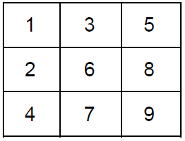

# Week 1 Practice Questions
Feel free to copy the code provided into your own MATLAB scripts to check your work! Please remember that although these are answers, there are multiple ways of doing the problem(s). We encourage you to develop your own method of writing and organizing your code!
- [Lectures](https://jacksonburns.github.io/MATLAB-Start-to-Finish/Lectures/Lectures-Landing-Page)
- [Practice Problems](https://jacksonburns.github.io/MATLAB-Start-to-Finish/Practice-Problems/Practice-Problems-Landing-Page)
To download this file as a PDF, go [here](https://github.com/JacksonBurns/MATLAB-Start-to-Finish/blob/master/Practice-Problems/Week-1/Mini-Assignment%20Week%201.pdf).

**Basic Matrix Exercises (Week 1):**
*Please remember to comment your code and label your graphs!*
1. Define the following matrix and do the following exercises. (Each exercise should be done independently of each other)

	a. Multiply each element by 3
	b. Add 2 to each element
	c. Isolate row 1
	d. Isolate column 3
	e. Divide 8 by 2 and subtract it by 5
	f. Replace the 7 with your answer from e
2. Define the following additional matrix and do the following exercises with the matrix from the first exercise

	a. Multiply the two matrices together (non element wise)
	b. Multiply the two matrices together (element wise)
	c. Add and subtract the matrices element-wise
	d. Add the 3 from both matrices together
	e. Multiply the entire first matrix by the second column in the second matrix. (PS: Order matters!)
	
**For Loop Exercises (Week 1):**
1. Create a for loop that accepts a 1xm matrix of random numbers of 0 and 1 and tells you how many elements are greater than 0.
	a. You can create such a matrix by the following command:
		i. randi([0,1],n,m)
	b. To find the length of a list, use the following command:
		i. length(x)

**Script/ Function Exercises (Week 1):**

1. Create a function that accepts two matrices and gives outputs for the operations done in the Live Script Exercises 1a, 1c, 1d, 2a-c, and 2e.
